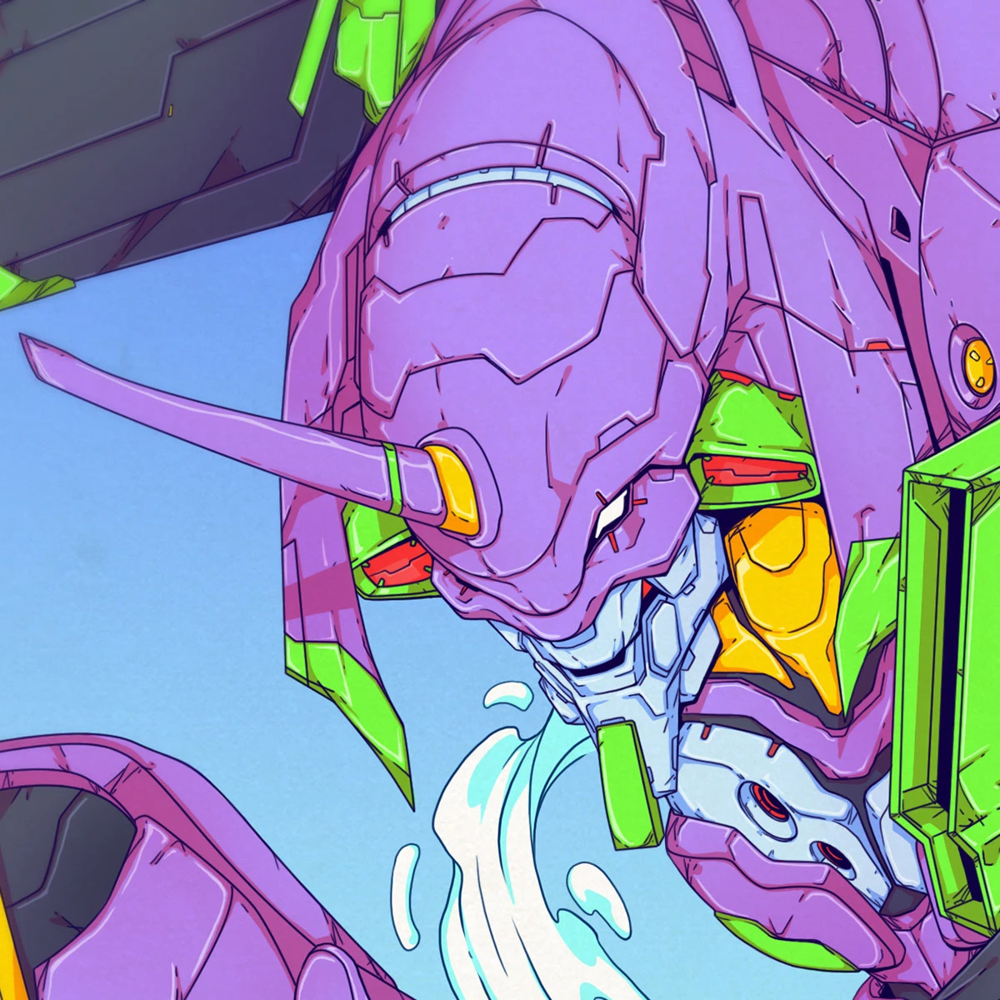

<div align="center">
    <p>
        
    </p>
</div>

```zsh
gaurav@nile: ~/readme $ fastfetch
```



```csharp
------------------------------------------------------------
username: gaurav-null
whoami: cr @ frcrce
pronouns: he/him
os: arch linux
languages: javascript, java
learning: kafka
reading: Dune
locations: India
hobbies: programming, gaming, anime/manga, music, video editing
song: String Theory by wishlane
favorite.game: apex legends
favorite.anime: Evangelion: 3.0+1.0 Thrice Upon a Time
------------------------------------------------------------
```

<h3 align="center"> Languages & Tools</h2>

<p align="center">
  <a href="https://skillicons.dev">
    
  </a>
</p>


<div align="center">
<h3 align="center">Connect with me</h3>

[](-)
[](https://www.linkedin.com/in/gaurav-nile-72860428a/)
[](https://github.com/gaurav-null)
</div>

<div align="center">
    


<h3 align="center">Thanks for Reading <3</h3>
